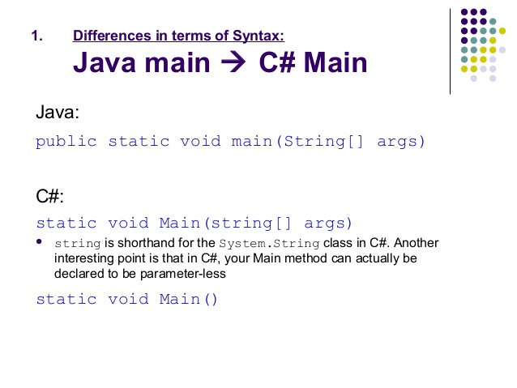

# Entry 3
##### 1/3/20

Hi all!

#### A Quick Recap
After a few weeks of study, and a new laptop to boot, my partner Yahia and I are on track to start coding our
project soon. As a quick refresher, we've settled on making an rpg, or role-playing game, similar to popular
games like Final Fantasy or Pokemon. We'll be using C#, and working in Unity for the project.

#### Our Process
As mentioned in [our last entry](entry02.md), Yahia and I have been working on [W3Schools](https://www.w3schools.com/cs/cs_intro.asp) here and there to get a feel for
the syntax of C#. Things went quickly with that, so w've now moved on to brainstorming ideas for the game,
with a specific focus on the layout of the menus/GUIs, and the variables that we are going to need for the game
to function as an MVP (minumum viable product). In doing that, we've started to categorize the variables into "in
battle" variables and "out of battle" variables as well as those that would apply to both scenarios. If you are
interested in what we have so far, check out [our list of variables](https://docs.google.com/document/d/18f9qcz2JyZ-BGMIxdP59HZ8n27FTovv30-qeWeXPChY/edit?usp=sharing) on Google Docs. Going forward, we'll probably
edit this document to include more of what we need.

#### What We've Learned So Far
Though we talked about it in our previous entry, it is worth reiterating that our progress in making our game has
been accelerated thanks to the similarities between C# and Java, the language we are learning in class. They
are both object oriented, functioning through the use of classes and methods, but C# is especially good for
making games thanks to the way it backs up memory. In comparison to Java, which often has problems with
memory leakage, C# is specifically made as a "managed language", which means that memory allocation is
handled automatically. This makes it so games will crash significantly less, both during testing/debugging and
when running it from the user-end later on. Of course, there are differences in syntax that we're still getting
used to, such as:

In the end, though, it isn't so big of a deal, and we're able to refer to [W3Schools](https://www.w3schools.com/cs/cs_intro.asp) whenever we need.

#### How We've Improved
One of the main things that Yahia and I have been working on, and will continue to work on as we move
forward is our time management skills. As great as our work has been going, we haven't been using our class
time as wisely as we could be. That all changed this week, however. While we were in class, Yahia and I were
trying to install the Unity Hub, as well as the editors on our computer. When our classmate, Josh, who is also
working on a project using Unity, said that he was having a similar problem with the installation, we brought it to
Mr. Mueller's attention. We're working on installing the Unity editor on a laptop to test if that would be more
efficient, and until we do so, Yahia and I are unable to begin coding. As a result, Yahia and I decided to make a
draft of what our game might look like, and [a list of variables](https://docs.google.com/document/d/18f9qcz2JyZ-BGMIxdP59HZ8n27FTovv30-qeWeXPChY/edit?usp=sharing) that will be needed to make our game function in a
basic state.

#### Next Steps
Going forward, Yahia and I will be working more on our sketches and our variables. Once that's complete, we
will likely figure out how we'll be dividing our work so that we can code those varaibles quickly and efficicently.
Once we get Unity up and running, we're probably going to start coding basic things, such as movement and
text boxes. Regardless, we'll see you next time with an update. See you then!

[Previous](entry02.md) | [Next](entry04.md)

[Home](../README.md)