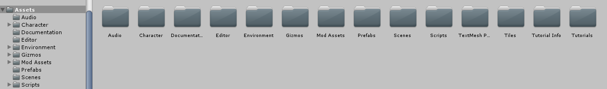
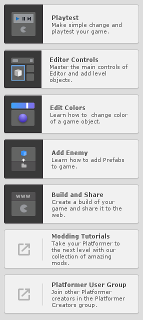

# Entry 4
##### 2/7/20

Hello again, everyone!

#### A Quick Recap
As usual, Yahia and I have made more progress into making our rpg idea a reality. With C# and Unity, we are
making a project similar in nature to other role-playing games, such as Final Fantasy, or Pokemon.

#### Our Process
We mentioned in [our previous entry](entry03.md) that we've been working with tutorials in [W3Schools](https://www.w3schools.com/cs/cs_intro.asp) to try and learn C#.
While we will still be keeping W3Schools on hand for times when we forget syntax or need some other type of
refresher, we've finally moved on to actually exploring Unity. Over the past few weeks, Yahia and I have started
looking at Unity's interface, and we've figured out some interesting things that might make our project come
together quicker than we thought.

For those who also want to explore Unity, you can read about it as well as download it at their website [here](https://unity.com/).

#### What We Have Learned
As I briefly alluded to before, Yahia and I started exploring Unity's interface, since we figured it would be helpful
to learn that as well as C# on its own. In doing that, we discovered that Unity may actually be the main place we
do our coding/debugging. The reason for this is because of how Unity organizes its files. Below the "screen" of
our workspace lies a very simple list of the folders in our game, as shown below:

In each of these folders lies specific files relating to different aspects of our game. For example, in the pre-
made project shown above, there are folders for the player character, audio, and environments. While our
project likely won't need so many of these folders, since we're leaning toward 2D graphics, it's great to know
that we at least don't need a new IDE just for specific things, such as graphics or audio. This will make the
coding process of our project significantly more streamlined and efficient.

It's just like Mr. Mueller said: "Be curious!"

#### How We're Improving
First of all, I'd like to mention how we've been hopping along the engineering design process, but we're
finally finishing up with our plan, and are on course to start our prototype soon.

Though mentioned in the previous entry, Yahia and I are working on divvying up the work ahead of us to
make it less overwhelming when we start coding. This has been beneficial for our delegatory skills, since we
worked out just what we will be doing. In doing that, we've decided to each download different a pre-made Unity
project, and follow through with the tutorials provided to make sure there isn't anything else we need to learn
before we start making our own project. We decided this would be the best course of action because of our
schedules this week. Both of us have numerous projects due and a few tests coming up, so starting to code
would only make us more stressed. Instead, we will run through the tutorials this week, and when the weekend
comes, we'll start prototyping our project. With a full week off from school, we have a large span of time to get
things done, such as our basic variables and how they will be changed by the user.

Looks like those time management skills from last entry really are helpful.

Also, for those curious, there are projects on the Unity website and the Unity Hub that come with these tutorials.
Look for projects with these on the right hand side of the editor:

#### Next Steps
If it wasn't already obvious, Yahia and I really need to get ourselves ready for the coming break, since that is
when our work will really start to manifest itself. Finishing those tutorials and getting ourselves started with our
own project is our main priority right now. In short, we're about to start the prototyping phase of our project.
Hopefully, we'll be seeing you next time with an update of how it went. Until then have a good few weeks!

[Previous](entry03.md) | [Next](entry05.md)

[Home](../README.md)