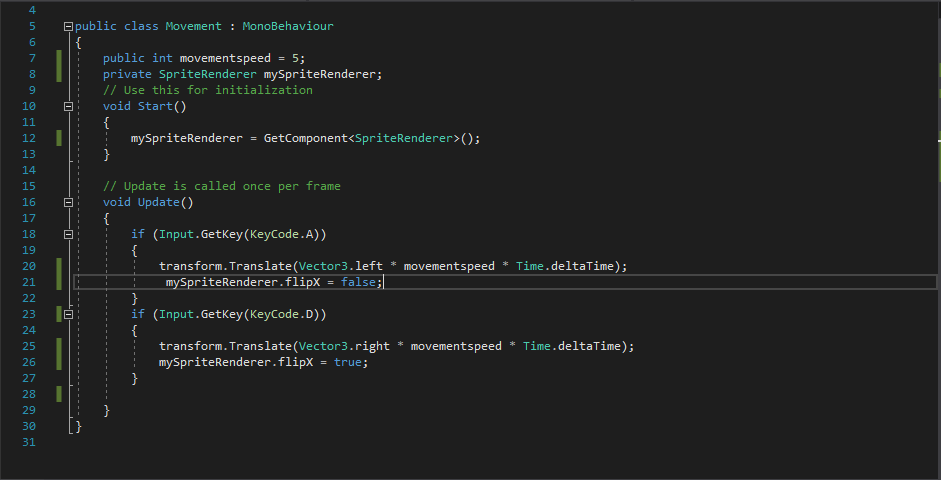

# Entry 5
##### 3/15/20

Hello again, everyone!

#### A Quick Recap
Yahia and I have gotten further with out rpg. With C# and Unity, it's finally starting to take form.

As per usual, the links for C# on [W3Schools](https://www.w3schools.com/cs/cs_intro.asp) and [Unity's own website](https://unity.com/) are here for those that are interested in
learning more.

#### Our Process
After a long break and a few more opportunities to really get ourselves in order, Yahia and I have begun the
protoyping phase of our game. In doing so, we've realized that the best course of action is to scale our project
down. This came to us as a bit of a shock at first. After our teacher, Mr. Mueller, reminded us of the importance
of an MVP being __viable__, we realized that this was the best choice. For those confused as to what I mean, Yahia
and I essentially decided that we're going to be making a simpler version of our game, meaning that it will be
more achievable for us. Worry not, though, we're still aiming to make a game that will be fun to play and fun to
make, so look forward to it!

#### What We've Learned
Onto the fun stuff! In our initial tinkering, Yahia and I quickly ran into some problems with scripts, and how they
interact with game elements in Unity. Basically, it's a similar situation to Java, where giving instructions to a
class allows us to create a new instance of that class, and then give that instance certain instructions based on
parameters we give it.

In short, APCSA's Java knowledge strikes again!

Well, mostly. There are a few differences in syntax, as I've said in [previous entries](entry03.md). If you want an example of
what I mean, take a look at this screenshot, as provided by Yahia himself:

Probably the most noticable difference between Java and C# is the way we write classes. In Java, a similar class might only need to look like:
`public class Movement`, without needing the extra colon and
`MonoBehavior`. Just as a quick sidenote, 'MonoBehavior' is something that needs to be written in pretty much
every class/script we'll be making in Unity. It is the base class which every Unity script needs to come from.
Think of it as a class in Java that we need to explicity extend into a child class.

Of course, there are more differences than just that (such as the Start and Update loop). If you'd like to read
about them, you can do so on [Unity's website](https://unity.com/), where you can also download Unity and tinker yourself.

#### How We're Improving
Now that we're in our protoyping phase of our engineering design process, the most importnat thing for Yahia
and I to do is consider how our variables are going to be implemented as scripts. Step one of that came a little
earlier than expected. Earlier, I mentioned that our project is going to need an MVP, or a minimum viable
product. In simple terms, it means that our time management skills are more important than ever, but so are our
descision making skills. What I mean by that is this: __We have a limited time to finish this project, or at least__
__the version of it that will be presented later on in the year. More than anything, Yahia and I need to__
__priorotize what things are and are not necessary for our game to function, and be fun.__

If you remember, I had previously linked to the [document](https://docs.google.com/document/d/18f9qcz2JyZ-BGMIxdP59HZ8n27FTovv30-qeWeXPChY/edit?usp=sharing) where Yahia and I stored our varaibles. After Mr.
Mueller's reminder of our project needing to be __viable__, we cut down that list into something way more
manageable. If you'd like, you can take a look at it [here](https://docs.google.com/document/d/1IHgx7vKUcvAGWC2mfesoaR7dDUe9hjNVIngcb9vtm8Q/edit?usp=sharing).

#### Next Steps
Now that we've begun to tinker and code, Yahia and I are going to need a way to keep each other "in the loop"
(pun partially intended). To do that, we're going to set up some way of giving whatever code we make to one-
another. Most likely, we will be setting up a Github repository. Regardless, I'll be back next time to tell you about
all the progress we've made. Until then, have a great few weeks!

[Previous](entry04.md) | [Next](entry06.md)

[Home](../README.md)